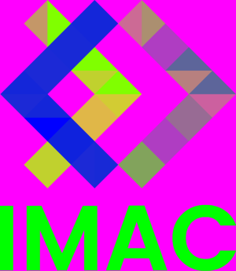
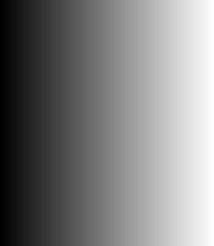
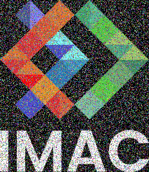
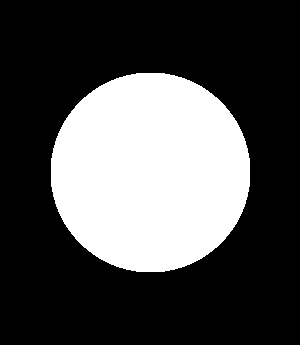
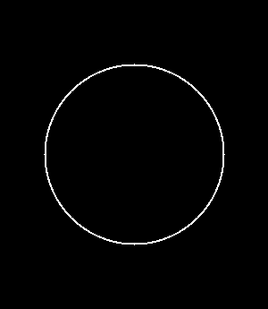

# 🐣 S1 | Prog: Workshop

## Vert

 ➡️ 

## Echange

 ➡️ 

## Negatif

 ➡️ 

## Degrade

## Miroir

 ➡️ 

## Bruit

 ➡️ 

## Rotation

 ➡️ 

## RGB Split

 ➡️ 

## Luminosite

 ➡️ 

## Disque

## Cercle

## Glich

 ➡️ 

## Contraste

 ➡️ 

### Explication

On parcours tous les pixels pour trouver le pixel le plus sombre et le plus clair.
Ensuite on parcours à nouveau tous les pixels, et on applique une transformation sur chaque couleur dans la "nouvelle échelle" de luminosité.

## Convolution

 ➡️ 

### Explication

On choisit une taille de kernel, qui va représenter l'intensité du flou.
Pour chaque pixel, on parcours les pixels autour de lui, et pour chaque couleur on fait la moyenne des pixels autour. Ici j'ai fait une version simplifié dans laquelle tous les pixels ont le même poids.
